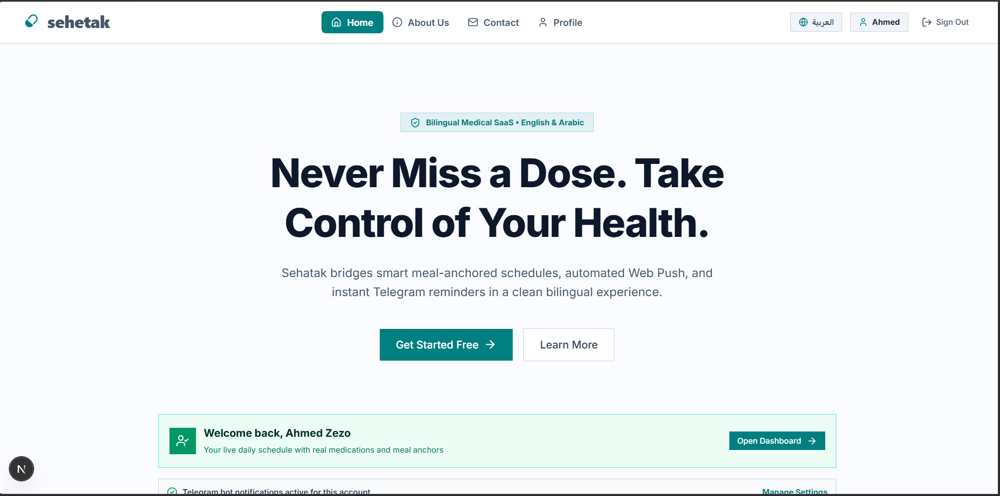

# Sehatak 💊

> **Smart Meal-Anchored Medication Companion & Healthcare Platform**  
> *A comprehensive digital healthcare solution designed to solve medication non-adherence through meal-anchored schedules, automated Web Push notifications, and instant 1-click Telegram Bot reminders.*



---

## 🌟 Key Features

- 🕒 **Meal-Anchored Scheduling**:
  - Dynamically calculates medication dose times based on daily shifting meal times (Breakfast, Lunch, Dinner).
- 🔔 **Multi-Channel Automated Reminders**:
  - **Web Push Notifications**: Background notifications via Service Workers (`public/sw.js`) and VAPID protocol.
  - **Telegram Bot 1-Click Sync**: Instant Telegram notifications with 1-click action buttons to mark doses as taken.
- 🌐 **Full i18n & RTL/LTR Localization**:
  - Seamless subpath internationalization (`/ar` and `/en`) with localized typography (Cairo for Arabic, Inter for English).
- 🎨 **High-Fidelity GSAP Motion Design**:
  - Interactive **Shared Sliding Gooey Liquid Navbar Menu**.
  - Staggered entrance cards, floating medical icons, and fluid micro-interactions.
- 📊 **Adherence Metrics & Logs**:
  - Daily adherence percentage calculation, dose status logging (Taken, Skipped, Pending).
- 📅 **Doctor Appointments & Prescriptions**:
  - Manage doctor visits, upload prescriptions, and track upcoming appointments.
- 🛡️ **Role-Based Admin Portal**:
  - Executive dashboard for managing users, central medication catalog, and real-time system stats.

---

## 🛠️ Technology Stack

- **Core Framework**: [Next.js 16 (App Router & Turbopack)](https://nextjs.org/)
- **Language**: [TypeScript](https://www.typescriptlang.org/)
- **Backend & Database**: [Supabase](https://supabase.com/) (PostgreSQL, Row Level Security, Edge Functions, RPC Stored Procedures)
- **Animation Engine**: [GSAP (GreenSock Animation Platform)](https://gsap.com/)
- **Styling**: [Tailwind CSS](https://tailwindcss.com/) (Clean Medical Light Aesthetic)
- **Data Fetching**: [TanStack Query (React Query)](https://tanstack.com/query)
- **State Management**: [Zustand](https://zustand-demo.pmnd.rs/)
- **Notification Engine**: Web Push API (`web-push`) & Telegram Bot Webhooks
- **UI Components & Icons**: Lucide React & Sonner Toasts

---

## 📁 Project Architecture

```
root/
├── public/
│   ├── sw.js                         # Service Worker for background Web Push
│   ├── logo.svg                      # Brand vector logo
│   └── favicon.svg                   # App browser icon
│
├── src/
│   ├── app/                          # Next.js App Router
│   │   ├── [locale]/                 # Dynamic subpath routing (en / ar)
│   │   │   ├── (auth)/               # Login & Register views
│   │   │   ├── (dashboard)/          # Patient & Admin protected routes
│   │   │   ├── (marketing)/          # Landing, About, Contact & Legal pages
│   │   │   ├── layout.tsx            # Locale Root Layout with SEO Schema
│   │   │   └── page.tsx              # Landing page entry
│   │   └── api/                      # Next.js BFF API & Webhooks
│   │       ├── push/                 # Web Push subscription endpoints
│   │       ├── telegram/webhook/     # Telegram Bot webhook & deep link handler
│   │       └── cron/                 # Background reminder dispatch webhook
│   │
│   ├── components/                   # Core Shared UI Components
│   │   ├── layout/                   # Navbar (GSAP NavMenu), Footer
│   │   └── ui/                       # Primitive UI Elements (Button, Modal, Input)
│   │
│   ├── features/                     # Feature-Driven Slicing Modules
│   │   ├── dashboard/                # Daily timeline, adherence metrics
│   │   ├── medications/              # Multi-step creation & dose logs
│   │   ├── appointments/             # Doctor visits & calendar
│   │   └── notifications/            # Web Push & Telegram hooks
│   │
│   ├── lib/
│   │   ├── supabase/                 # Supabase Browser, Server & SSR clients
│   │   └── push/                     # VAPID web-push configuration
│   │
│   ├── messages/                     # Translation Dictionaries (en.json / ar.json)
│   └── styles/                       # Global Tailwind CSS styling
│
└── supabase/                         # Local SQL Migrations, RLS & Edge Functions
```

---

## ⚙️ Environment Variables Setup

Create a `.env.local` file in the root directory and configure the following variables:

```env
# Supabase Configuration
NEXT_PUBLIC_SUPABASE_URL=your_supabase_project_url
NEXT_PUBLIC_SUPABASE_ANON_KEY=your_supabase_anon_key
SUPABASE_SERVICE_ROLE_KEY=your_supabase_service_role_key

# Web Push VAPID Keys
NEXT_PUBLIC_VAPID_PUBLIC_KEY=your_vapid_public_key
VAPID_PRIVATE_KEY=your_vapid_private_key
VAPID_SUBJECT=mailto:support@sehetak.app

# Telegram Bot Integration
TELEGRAM_BOT_TOKEN=your_telegram_bot_token
TELEGRAM_BOT_USERNAME=your_bot_username

# Cron Execution Security Key
CRON_SECRET=your_cron_secret_key
```

---

## 🚀 Getting Started

### 1. Clone Repository & Install Dependencies

```bash
git clone https://github.com/3b3zeem/Sehetak.git
cd Sehetak
npm install
```

### 2. Run Database Migrations

Apply local SQL migrations to your Supabase instance:

```bash
npx supabase db push
```

### 3. Start Development Server

```bash
npm run dev
```

Open [http://localhost:3000](http://localhost:3000) to view the application in your browser.

### 4. Build for Production

Validate production builds and TypeScript type safety:

```bash
npm run build
```

---

## ⏰ Cron & Background Reminder Dispatch

Recurring medication checks execute via Supabase `pg_cron` calling the dispatch endpoint:

```http
POST /api/cron/dispatch-reminders
Authorization: Bearer YOUR_CRON_SECRET
```

This endpoint checks all active dose schedules for the current time window, calculates dynamic meal offsets, dispatches Web Push payloads to registered Service Workers, and sends interactive Telegram notifications to linked users.

---

## 📄 License & Ownership

Developed with ❤️ for **Sehatak Platform**. All rights reserved.
